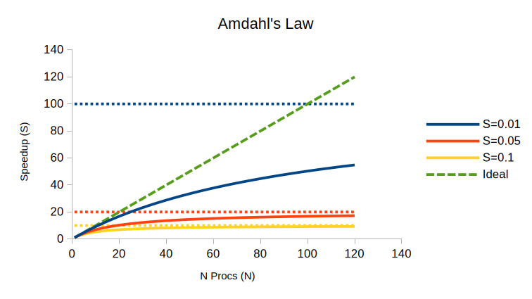
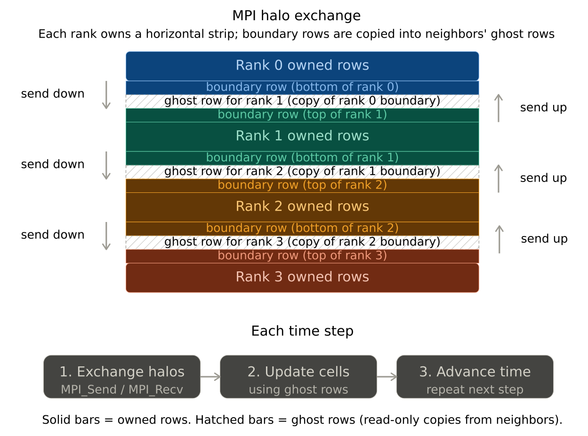
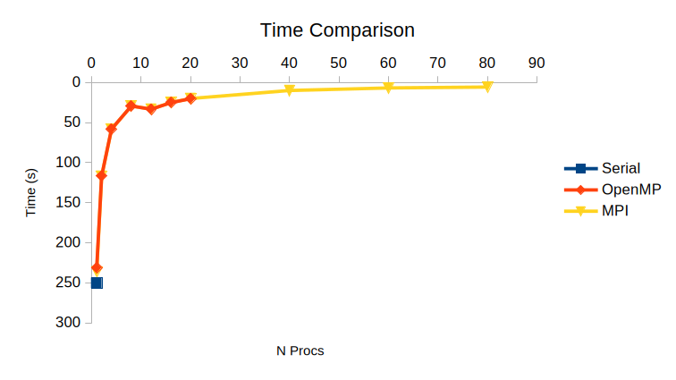
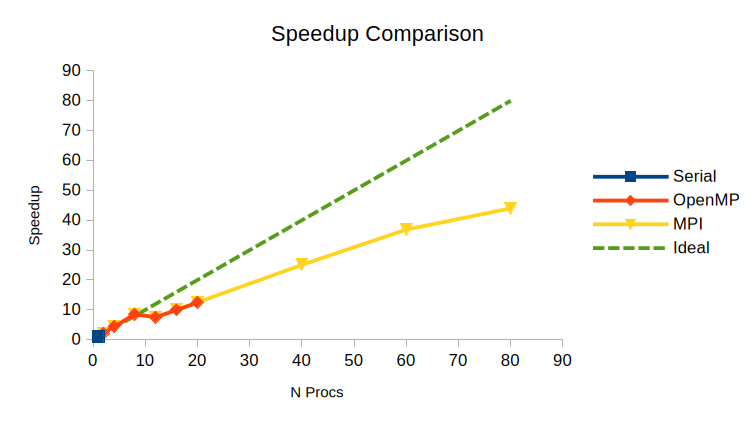
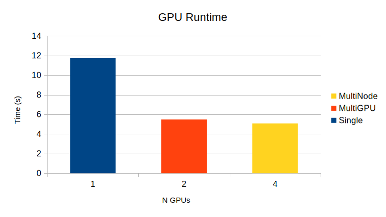

# Research Computing Training

## Presenter

Ghanghoon "Will" Paik

HPC Performance Engineer

[Research Computing](https://rc.northeastern.edu/research-computing-team/)

## Introduction to Parallel Computing

Welcome to the [Research Computing Spring 2026 Training Series](https://rc.northeastern.edu/research-computing-spring-training/)!

During the session, we will be exploring how to scale your computation from a single core to multiple GPUs across nodes. We will cover some basic concepts, compare real benchmark results, and testing working codes that you can run on the cluster yourself.

Today's Agenda:

[1. Why Parallel Computing?](#1-why-parallel-computing)  
[2. Types of Parallelism (Flynn's Taxonomy)](#2-types-of-parallelism-flynns-taxonomy)  
[3. Shared vs. Distributed Memory](#3-shared-vs-distributed-memory)  
[4. The Speed Limit: Amdahl's Law](#4-the-speed-limit-amdahls-law)  
[5. CPU Parallelism in Practice: Conway's Game of Life](#5-cpu-parallelism-in-practice-conways-game-of-life)  
[6. GPU Computing](#6-gpu-computing)  
[7. Scaling ML Workloads with PyTorch](#7-scaling-ml-workloads-with-pytorch)  
[8. Parallel Computing in Python, R, and MATLAB](#8-parallel-computing-in-python-r-and-matlab)  
[9. Summary and Resources](#9-summary-and-resources)  

All sample code used in this session is available at **[
Intro-to-HPC-Scaling-Parallel-Computing-2026
](https://github.com/northeastern-rc-training/Intro-to-HPC-Scaling-Parallel-Computing-2026)**

---

## 1. Why Parallel Computing?

Most research workloads (e.g. simulations, data processing, model training) eventually hit a wall: a single CPU core is not fast enough.

Parallel computing splits work across multiple processing units so that tasks finish sooner.

### The Pipelining

**Serial:** You wash, dry, and fold one load at a time. The next load waits until the first one is completely done.

| | | | | | | | | | |
| --- | --- | --- | --- | --- | --- | --- | --- | --- | --- |
| **Load 1** | wash | dry | fold | | | | | | |
| **Load 2** | | | | wash | dry | fold | | | |
| **Load 3** | | | | | | | wash | dry | fold |

**Task Parallelism (Pipelining):** While Load 1 is in the dryer, Load 2 goes into the washer. The machines stay busy.

| | | | | | |
| --- | --- | --- | --- | --- | --- |
| **Load 1** | wash | dry | fold | | |
| **Load 2** | | wash | dry | fold | |
| **Load 3** | | | wash | dry | fold |

**Data Parallelism:** You have 3 washers and 3 dryers. You split a laundry into 3 loads and process them all at once.

| | | | |
| --- | --- | --- | --- |
| **Load 1** | wash | dry | fold |
| **Load 2** | wash | dry | fold |
| **Load 3** | wash | dry | fold |

Mostly we will focus on data parallelism: splitting a large problem into smaller subproblems and solving them simultaneously.

---

## 2. Types of Parallelism (Flynn's Taxonomy)

Flynn's Taxonomy classifies computing architectures by how instructions and data flow through the system.

Classified as: [----] Instruction [----] Data

| Type     | Instruction | Data     | Example                      |
| -------- | ----------- | -------- | ---------------------------- |
| **SISD** | Single      | Single   | Traditional single-core CPU  |
| **SIMD** | Single      | Multiple | GPU cores, vector operations |
| MISD     | Multiple    | Single   | Rare, fault-tolerant systems |
| **MIMD** | Multiple    | Multiple | Multi-node HPC clusters      |

For today, the two that matter most:

- **SIMD** is GPU computing: apply the same task to thousands of data points at once.
- **MIMD** is like spreading workload across multiple nodes on the cluster. Each task runs on its own data.

---

## 3. Shared vs. Distributed Memory

How processors access memory determines which tools you use.

### Shared Memory (Single Node)

Multiple CPU cores share the same physical memory (RAM). Any core can access any memory address.

- Easier to program. No need to manually move data between cores.
- Standard tool: **OpenMP**
- Limitation: You are bound by the number of cores and RAM on a single machine.

### Distributed Memory (Multi-Node)

Each node has its own physically separated memory. Node A cannot directly read Node B's memory.

- Programs must explicitly send and receive data over the network.
- Standard tool: **MPI** (e.g. OpenMPI, Intel MPI, or MPICH)
- Advantage: You can scale across multiple nodes.

### Hybrid Approach

Often, HPC applications use both: MPI across nodes and OpenMP within a node. We will see this with the example later.

---

## 4. The Speed Limit: Amdahl's Law

Not everything can be parallelized. Some parts of your code could be serial (reading data, writing final output, sequential dependencies).

**Amdahl's Law** tells us that the maximum speedup is limited by the serial portion of the program:

```
Speedup = 1 / (S + P/N)

S = serial portion
P = parallel portion (1 - S)
N = number of processors
```

**Example:** If 10% of your code is serial (`S = 0.1`), the theoretical maximum speedup is 10x, no matter how many processors you throw at it.



**Programming tip:** Always plan out your code first. Check what can be parallelized and what cannot be. Converting completed serial code to parallel version is not a good practice.

---

## 5. CPU Parallelism in Practice: Conway's Game of Life

Conway's Game of Life is a 2D grid simulation where each cell's next state depends on its 8 neighbors. 

The rules can be found in [Wikipedia page](https://en.wikipedia.org/wiki/Conway%27s_Game_of_Life).


It is embarrassingly parallel because every cell calculation is independent within a single time step.

### 5.1 Serial Baseline

A single core iterates through every cell in the grid, row by row.

### 5.2 OpenMP (Shared Memory)

By adding an OpenMP directive, we distribute the grid computation across multiple cores on a single node.

```cpp
#pragma omp parallel for collapse(2)
for (int i = 1; i <= rows; i++) {
    for (int j = 1; j <= cols; j++) {
        // compute next state for cell (i, j)
    }
}
```

`#pragma omp` directive can be recognized by the compiler, and it handles thread creation and distribution.

### 5.3 MPI + OpenMP (Distributed Memory)

When the grid is too large for single node's memory, or you need more cores, we can split the grid across multiple nodes using domain decomposition.

**Domain Decomposition:** The grid is divided into horizontal strips. Each MPI rank owns one strip.

**Halo Exchange (Ghost Zones):** Cells on the boundary of a strip need neighbor data from adjacent strips on other nodes. Before each time step, ranks exchange their boundary rows using `MPI_Send` and `MPI_Recv`.



MPI programming guide can be found in [RC User Document](https://rc-docs.northeastern.edu/en/latest/software/systemwide/mpi.html).

### 5.4 Benchmark Results

Grid size: 10000 x 10000, 500 iterations


| Configuration | Cores        | Wall Time (s) | Speedup |
| ------------- | ------------ | ------------- | ------- |
| Serial        | 1            | 250.7            | 1.0x    |
| OpenMP        | 2            | 116.8            | 2.2x     |
| OpenMP        | 4            | 58.1            | 4.3x     |
| OpenMP        | 8            | 29.4            | 8.5x     |
| OpenMP        | 12           | 33.4            | 7.5x     |
| OpenMP        | 16           | 25.2            | 10.0x     |
| OpenMP        | 20           | 20.2            | 12.4x     |
| MPI + OpenMP  | 40 (2 nodes) | 10.0            | 25.1x     |
| MPI + OpenMP  | 60 (3 nodes) | 6.8            | 36.9x     |
| MPI + OpenMP  | 80 (4 nodes) | 5.7            | 44.0x     |




Things to notice:

- OpenMP scaling within a single node should be relatively efficient since there is no network overhead.
- MPI scaling introduces communication cost, so the speedup curve will flatten compared to the ideal line.
- Compare this real result to the Amdahl's Law graph from Section 4.

---

## 6. GPU Computing

### 6.1 CPU vs. GPU Architecture

||CPU|GPU|
|---|---|---|
|Design goal|Low latency|High throughput|
|Core count|Tens of complex cores|Thousands of simple cores|
|Best for|Sequential logic, branching|Same operation on large arrays|

A CPU is like a few professional chefs preparing for complicated dishes. A GPU is like a thousand line cooks each doing a simple task simultaneously to prepare for a buffet.

### 6.2 How GPU Programs Work (CUDA)

At a high level, a GPU program follows steps:

1. **Allocate** memory on the GPU (`cudaMalloc`)
2. **Copy** data from CPU to GPU (`cudaMemcpy`: Host to Device)
3. **Launch** a kernel: thousands of threads execute the same function on different data
4. **Copy** results back from GPU to CPU (`cudaMemcpy`: Device to Host)

*(Host = CPU and Device = GPU)*

A sample CUDA kernel for matrix multiplication looks like:

```cuda
__global__ void MatMulKernel(float *A, float *B, float *C, int N) {
    int row = blockIdx.y * blockDim.y + threadIdx.y;
    int col = blockIdx.x * blockDim.x + threadIdx.x;
    // each thread computes one element of C
}
```

Every thread calculates a single element of the output matrix. With a 1024x1024 matrix, that is over a million threads running in parallel.

You may not need to write low level CUDA code for most research workloads. Libraries like PyTorch, CuPy, and RAPIDS handle this for you. But understanding the model helps you understand the workflow better.

---

## 7. Scaling ML Workloads with PyTorch

### 7.1 Single GPU

The basic pattern: create tensors on the GPU device and let PyTorch call optimized CUDA kernels internally.

```python
import torch

device = torch.device("cuda" if torch.cuda.is_available() else "cpu")
a = torch.randn(4096, 4096, device=device)
b = torch.randn(4096, 4096, device=device)
c = torch.matmul(a, b)  # runs on GPU automatically
```

### 7.2 Multi-GPU (Single Node)

When you need more than one GPU, PyTorch can split one large operation across multiple GPUs on the same node. The example below partitions matrix A by rows and computes each block on a different GPU in parallel.

```python
import torch

num_gpus = torch.cuda.device_count()
N = 4096
shard_rows = N // num_gpus

# Place a row-shard of A and a full copy of B on each GPU
shards = []
for i in range(num_gpus):
    device = torch.device(f"cuda:{i}")
    a_shard = torch.randn(shard_rows, N, device=device)
    b_full  = torch.randn(N, N, device=device)
    shards.append((a_shard, b_full))

# Each GPU computes its slice of C in parallel (kernel launches are async)
c_shards = [torch.matmul(a, b) for a, b in shards]

# Wait for all GPUs to finish
for i in range(num_gpus):
    torch.cuda.synchronize(i)
```

### 7.3 Multi-Node Distributed Training

In case you are working on large-scale model training across multiple nodes, PyTorch uses Distributed Data Parallel (DDP).

Key concepts:

- **Backend:** `nccl` (NVIDIA's GPU-optimized communication library, similar to MPI but for GPUs)
- **World size:** Total number of GPUs across all nodes
- **Rank:** Each GPU's unique ID in the cluster
- **Local rank:** GPU index within a single node

The communication test:

```python
import os
import torch
import torch.distributed as dist

local_rank = int(os.environ["LOCAL_RANK"])
torch.cuda.set_device(local_rank)
dist.init_process_group(backend="nccl")

tensor = torch.ones(1, device=f"cuda:{local_rank}")
dist.all_reduce(tensor, op=dist.ReduceOp.SUM)
# If tensor == world_size, all GPUs are communicating correctly
```

`all_reduce` is the GPU equivalent of the MPI halo exchange concept: every GPU contributes its value, and the result is shared across all GPUs.

### 7.4 GPU Benchmark Results

Task: Matrix multiplication, 4096 x 4096, 100 iterations


| Configuration        | GPUs | Wall Time (s) | Speedup |
| -------------------- | ---- | ------------- | ------- |
| Single GPU           | 1    | 11.73         | 1.0x    |
| Multi-GPU (1 node)   | 2    | 5.48          | 2.1x    |
| Multi-Node (2 nodes) | 4    | 5.08          | 2.3x    |



Things to notice:

- Going from 1 to 2 GPUs on the same node can show near-linear speedup due to fast PCIe/NVLink interconnect.
- Cross-node scaling adds network latency, so the speedup can be less than linear.
- For real training workloads (not just matrix multiplication), the ratio of computation to communication determines how well multi-node scales.
- 
---

## 8. Parallel Computing in Python, R, and MATLAB

You do not always need C/C++/CUDA to use parallel computing. Here are common tools for research languages.

### 8.1 Python: mpi4py

`mpi4py` provides Python bindings for MPI, allowing you to write distributed-memory parallel programs.

```python
from mpi4py import MPI

comm = MPI.COMM_WORLD
rank = comm.Get_rank()
size = comm.Get_size()

# Each rank works on its own chunk of data
data = rank * 10
result = comm.reduce(data, op=MPI.SUM, root=0)
```

Launch with: `mpirun -np 4 python my_script.py`

Other Python parallel tools worth knowing: `multiprocessing` (shared memory), `concurrent.futures`, `Dask` (out-of-core and distributed), `Ray`

### 8.2 R: parallel and foreach

R includes the `parallel` package in its base installation.

```r
library(parallel)
cl <- makeCluster(detectCores() - 1)
results <- parLapply(cl, data_list, my_function)
stopCluster(cl)
```

The `foreach` + `doParallel` combination can be useful for embarrassingly parallel loops:

```r
library(foreach)
library(doParallel)
registerDoParallel(cores = 4)
results <- foreach(i = 1:100) %dopar% { my_function(i) }
```

### 8.3 MATLAB: Parallel Computing Toolbox

MATLAB provides `parpool` to create a pool of workers for parallel loops.

```matlab
parpool('local', 4);
parfor i = 1:1000
    results(i) = my_function(i);
end
```

`parfor` replaces a standard `for` loop. MATLAB handles the distribution.

Refer [RC MATLAB Guide](https://rc-docs.northeastern.edu/en/latest/software/systemwide/matlab.html#using-matlab-parallel-server) for detailed steps to run it in parallel.

### 8.4 Choosing the Right Tool

| Language      | Tool               | Memory Model    | Best For                            |
| ------------- | ------------------ | --------------- | ----------------------------------- |
| C/C++/Fortran | OpenMP             | Shared          | Loop-level parallelism, single node |
| C/C++/Fortran | MPI                | Distributed     | Multi-node simulations              |
| Python        | mpi4py             | Distributed     | Multi-node Python workloads         |
| Python        | multiprocessing    | Shared          | Single-node task parallelism        |
| Python        | Dask / Ray         | Both            | Large data, ML pipelines            |
| R             | parallel / foreach | Shared          | Embarrassingly parallel R tasks     |
| MATLAB        | parfor / parpool   | Shared          | Loop-heavy MATLAB computations      |
| Any           | PyTorch DDP        | GPU distributed | Deep learning model training        |

---

## 9. Summary and Resources

### Key Takeaways

1. **Profile first.** Find the bottleneck before parallelizing.
2. **Choose the right level.** Shared memory (OpenMP, multiprocessing) for single node, MPI for multi-node, and GPU for data-parallel math.
3. **Communication costs are real.** More nodes do not always mean faster. Communication overhead can dominate if the computation per node is small.
4. **Plan for parallelism** Think about what can be parallelized before writing the code. Retrofitting parallelism to finished serial code is often inefficient.

### Sample Code Repository

All code shown today is available at: **[
Intro-to-HPC-Scaling-Parallel-Computing-2026
](https://github.com/northeastern-rc-training/Intro-to-HPC-Scaling-Parallel-Computing-2026)**

Includes: Game of Life (serial, OpenMP), CUDA matrix multiplication, and PyTorch (single GPU) example

### Getting Help

Email the Research Computing team at [rchelp@northeastern.edu](mailto:rchelp@northeastern.edu).

Come to [office hours](https://rc.northeastern.edu/getting-help/) hosted on Zoom.

Or [book a consultation](https://rc.northeastern.edu/getting-help/) with an RC team member.

Review our [Documentation](https://rc-docs.northeastern.edu/en/latest/index.html).

Thank you!

---

_For questions or support, contact the Research Computing team at [rchelp@northeastern.edu](mailto:rchelp@northeastern.edu)_
